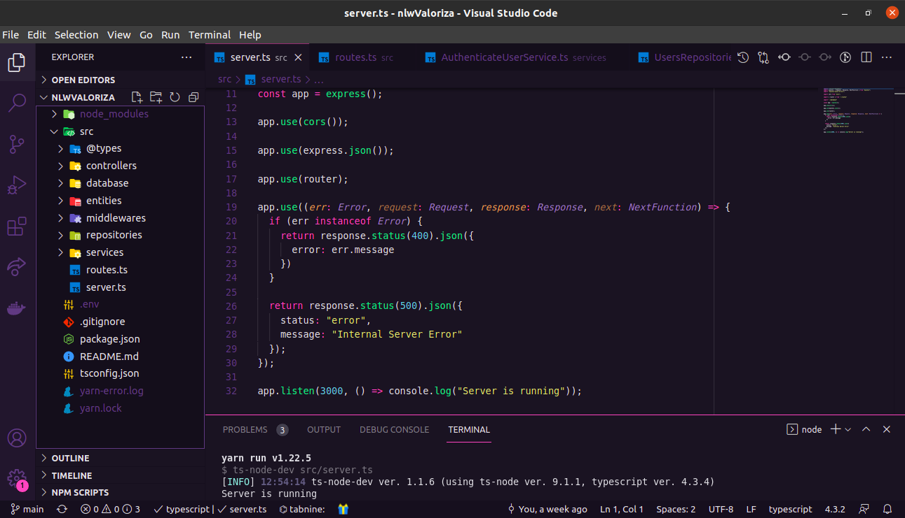

# :hearts: Valoriza v1.0
<p align="center">
  
  
  
  
  
</p>

Valoriza é uma plataforma para promover o reconhecimento entre companheiros de equipe.

## :computer: Tecnologias

Este projeto foi desenvolvido com as seguintes tecnologias:

- [Node.js](https://nodejs.org/en/)
- [Typescript](https://www.typescriptlang.org/)
- [Express](https://expressjs.com/pt-br/)
- [JSONWebToken](https://github.com/auth0/node-jsonwebtoken#readme)

### :man_technologist: Código:

<p align="center">
 
</p>

### :information_source: Como usar:

Para clonar e executar esta aplicação, você precisará do Git instalado em seu computador. Na linha de comando:

```bash
# Clonar este repositório
$ git clone https://github.com/DiegoTeixeira7/nlwValoriza.git

# Vá para o repositório
$ cd nlwValoriza

# Instale as dependências
$ sudo apt-get update
$ yarn install  | npm install

# Execute o projeto
$ yarn dev      | npm run dev
```

### :memo: Licença
Este projeto está sob a licença do MIT. Consulte a [LICENSE](LICENSE) para obter mais informações.
